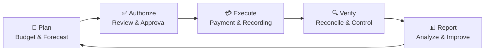

````markdown
<div align="center">

# 💼 Financial Team  
## First-Season Strategic Plan

### Building a Secure, Transparent & Scalable Financial Foundation


📅 **Date:** July 2026  
📑 **Document Type:** Strategic Planning & Governance  
🔐 **Classification:** Internal / Management Use

---

> **Our mission is to establish financial discipline, responsible governance, regulatory compliance, and reliable reporting systems that support sustainable organizational growth.**

</div>

---

## 📑 Table of Contents

- [Executive Summary](#-executive-summary)
- [Organizational Structure](#-organizational-structure)
- [Team Roles](#-team-roles--responsibilities)
- [Strategic Objectives](#-first-season-strategic-objectives)
- [Implementation Timeline](#️-12-week-implementation-timeline)
- [Performance Indicators](#-key-performance-indicators)
- [Season Deliverables](#-expected-first-season-deliverables)
- [Governance Principles](#️-financial-governance-principles)
- [Document Control](#-document-control)

---

## 🌟 Executive Summary

During its first operational season, the Financial Team will focus on creating a secure, transparent, compliant, and scalable financial foundation.

The department will prioritize:

- 🏛️ Financial governance
- 📚 Accounting accuracy
- 💰 Budgetary discipline
- 🏦 Treasury management
- 📊 Management reporting
- 🛡️ Internal financial controls
- ⚖️ Regulatory compliance
- 🔍 Financial risk management
- 🗂️ Audit-ready documentation
- 🚀 Long-term financial sustainability

The department will operate under the leadership of the **Chief Financial Officer** and consist of three core members with clearly assigned duties and shared accountability.

---

## 🏢 Organizational Structure

```mermaid
flowchart TD
    CEO["👤 Chief Executive Officer<br/>Executive Oversight"]
    CFO["💼 Chief Financial Officer<br/>Strategy • Governance • Leadership"]
    FAO["📚 Financial Operations &<br/>Accounting Officer"]
    TBC["🏦 Treasury, Budget &<br/>Compliance Officer"]

    CEO --> CFO
    CFO --> FAO
    CFO --> TBC
````

### 👥 Team Composition

| Position                                         | Primary Area            | Core Accountability                                        |
| ------------------------------------------------ | ----------------------- | ---------------------------------------------------------- |
| 💼 **Chief Financial Officer**                   | Strategy and governance | Financial leadership, approvals, risk and sustainability   |
| 📚 **Financial Operations & Accounting Officer** | Accounting operations   | Records, reconciliations, closing and financial statements |
| 🏦 **Treasury, Budget & Compliance Officer**     | Treasury and control    | Budgeting, cash flow, compliance and internal controls     |

---

# 👔 Team Roles & Responsibilities

<details open>
<summary><strong>💼 Chief Financial Officer — CFO</strong></summary>

### 🎯 Primary Mission

Lead the organization’s financial strategy, governance, capital planning, executive reporting, and long-term financial sustainability.

### 🔑 Key Responsibilities

* Develop financial strategies aligned with organizational objectives
* Establish the financial governance framework
* Design and approve financial policies and procedures
* Review and approve organizational budgets
* Approve expenditures according to delegated authority
* Oversee organizational cash-flow management
* Present financial reports to executive leadership
* Manage fundraising-related financial planning
* Oversee investor financial communications
* Identify and monitor financial risks
* Supervise internal and external audit activities
* Ensure regulatory and financial compliance
* Lead short-term and long-term financial planning
* Approve internal financial control procedures
* Monitor financial key performance indicators
* Coordinate with executive, legal and operational teams
* Develop financial sustainability and reserve strategies

### 📌 Core Ownership

`Strategy` • `Governance` • `Capital Planning` • `Executive Reporting` • `Risk Oversight`

</details>

---

<details>
<summary><strong>📚 Financial Operations & Accounting Officer</strong></summary>

### 🎯 Primary Mission

Maintain complete and accurate financial records while ensuring that daily accounting activities are executed consistently and supported by appropriate documentation.

### 🔑 Key Responsibilities

* Maintain the general ledger
* Record journal entries
* Record organizational expenses and revenue
* Perform bank and account reconciliations
* Coordinate monthly financial closing
* Maintain the fixed-asset register
* Process and document invoices
* Coordinate payroll information
* Maintain financial records and supporting evidence
* Administer the accounting platform
* Assist with audit preparation
* Prepare monthly financial statements
* Investigate accounting discrepancies
* Maintain an organized financial document archive
* Apply established accounting procedures

### 📌 Core Ownership

`Bookkeeping` • `General Ledger` • `Reconciliation` • `Monthly Close` • `Statements`

</details>

---

<details>
<summary><strong>🏦 Treasury, Budget & Compliance Officer</strong></summary>

### 🎯 Primary Mission

Protect the organization’s financial resources through disciplined budgeting, treasury management, compliance monitoring, and effective internal controls.

### 🔑 Key Responsibilities

* Prepare annual and departmental budgets
* Monitor actual spending against approved budgets
* Maintain rolling cash-flow forecasts
* Manage routine treasury operations
* Coordinate authorized banking activities
* Administer payment authorization workflows
* Verify expense approvals
* Monitor compliance with financial policies
* Implement internal control procedures
* Coordinate tax-related requirements
* Maintain the regulatory reporting calendar
* Schedule approved vendor payments
* Monitor liquidity and financial risks
* Maintain the financial risk register
* Support internal compliance reviews

### 📌 Core Ownership

`Budgeting` • `Treasury` • `Cash Flow` • `Compliance` • `Internal Controls`

</details>

---

# 🎯 First-Season Strategic Objectives

## 01 — 🏛️ Establish Financial Governance

### Deliverables

* Financial Governance Charter
* Delegation of Financial Authority Matrix
* Financial Policies and Procedures Manual
* Expense Approval Workflow
* Procurement Policy
* Asset Management Policy
* Financial Documentation Standards
* Conflict-of-Interest Declaration Process

### Success Indicators

* ✅ Governance documents formally approved
* ✅ Financial responsibilities clearly assigned
* ✅ Approval hierarchy fully operational
* ✅ Material transactions supported by authorization evidence

---

## 02 — 📚 Build the Accounting System

### Deliverables

* Standardized Chart of Accounts
* Configured accounting software
* Transaction-recording procedures
* Monthly closing checklist
* Financial document archive
* Accounting and reporting calendar
* Account reconciliation templates
* Fixed-asset register

### Success Indicators

* ✅ 100% of valid financial transactions recorded
* ✅ Monthly close completed according to schedule
* ✅ Complete and traceable audit trail established
* ✅ Supporting documentation linked to transactions

---

## 03 — 💰 Implement Budget Planning

### Deliverables

* Annual Operating Budget
* Departmental Budgets
* Budget Approval Process
* Rolling Forecasting Model
* Budget Monitoring Dashboard
* Budget Variance Report
* Budget Amendment Procedure

### Success Indicators

* ✅ Annual operating budget approved
* ✅ Monthly variance reports completed
* ✅ Spending maintained within approved limits
* ✅ Material variances investigated and documented

---

## 04 — 📊 Establish Financial Reporting

### Deliverables

* Monthly Financial Report
* Quarterly Executive Report
* Cash-Flow Statement
* Balance Sheet
* Income Statement
* Budget-versus-Actual Report
* Financial KPI Dashboard
* Executive Financial Summary

### Success Indicators

* ✅ Reports delivered by agreed deadlines
* ✅ Executive leadership has visibility into financial health
* ✅ Reports are supported by reconciled accounting data
* ✅ Decision-makers receive clear explanations of material variances

---

## 05 — 🏦 Strengthen Treasury & Cash Management

### Deliverables

* Rolling Cash-Flow Forecast
* Approved Bank Account Structure
* Vendor Payment Schedule
* Organizational Liquidity Plan
* Reserve Fund Policy
* Bank Reconciliation Process
* Authorized Signatory Register

### Success Indicators

* ✅ Sufficient operating liquidity maintained
* ✅ Approved obligations paid on schedule
* ✅ Cash-flow forecast updated weekly
* ✅ Bank access and authority properly controlled

---

## 06 — 🛡️ Build Compliance & Risk Management

### Deliverables

* Financial Compliance Checklist
* Internal Review Schedule
* Financial Risk Register
* Document Retention Policy
* Regulatory Compliance Calendar
* Internal Control Register
* Issue Escalation Procedure
* Corrective Action Tracker

### Success Indicators

* ✅ No known regulatory violations
* ✅ Internal reviews successfully completed
* ✅ Financial risks documented and monitored
* ✅ Financial records remain audit-ready
* ✅ Control deficiencies tracked through resolution

---

# 🗓️ 12-Week Implementation Timeline

```mermaid
gantt
    title First-Season Financial Implementation
    dateFormat  YYYY-MM-DD
    axisFormat  Week %W

    section Foundation
    Team formation and role assignment       :a1, 2026-07-01, 14d
    Governance framework                     :a2, 2026-07-01, 14d

    section Systems
    Accounting system implementation         :b1, after a1, 14d
    Financial policies and procedures        :b2, after a2, 14d

    section Planning
    Budget preparation                       :c1, after b1, 14d
    Treasury process implementation          :c2, after b2, 14d

    section Reporting
    Financial reporting framework            :d1, after c1, 14d
    KPI dashboard development                :d2, after c2, 14d

    section Assurance
    Compliance review                        :e1, after d1, 14d
    Internal control assessment              :e2, after d2, 14d

    section Evaluation
    Performance evaluation                   :f1, after e1, 14d
    Next-season strategic planning           :f2, after e2, 14d
```

### 📍 Phase Overview

| Phase | Period      | Primary Focus                  | Target Result                     |
| ----: | ----------- | ------------------------------ | --------------------------------- |
| **1** | Weeks 1–2   | Team formation and governance  | Roles and authority established   |
| **2** | Weeks 3–4   | Accounting system and policies | Financial operations activated    |
| **3** | Weeks 5–6   | Budgeting and treasury         | Spending and liquidity controlled |
| **4** | Weeks 7–8   | Reporting and dashboards       | Management visibility established |
| **5** | Weeks 9–10  | Compliance and controls        | Financial risks reduced           |
| **6** | Weeks 11–12 | Evaluation and planning        | Next-season roadmap approved      |

---

# 📈 Key Performance Indicators

## 🏛️ Governance

| KPI                                   | First-Season Target |
| ------------------------------------- | ------------------: |
| Required financial policies completed |            **100%** |
| Approval workflows implemented        |            **100%** |
| Authority matrix operational          |             **Yes** |
| Unauthorized material expenditures    |               **0** |

## 📚 Accounting

| KPI                                    |   First-Season Target |
| -------------------------------------- | --------------------: |
| Valid transactions accurately recorded |              **100%** |
| Monthly closing period                 | **≤ 5 business days** |
| Unexplained unreconciled accounts      |                 **0** |
| Transactions with supporting evidence  |              **100%** |

## 💰 Budget

| KPI                              | First-Season Target |
| -------------------------------- | ------------------: |
| Budget variance                  |      **Within ±5%** |
| Monthly budget reviews completed |            **100%** |
| Departmental budget compliance   |            **100%** |
| Material variances investigated  |            **100%** |

## 🏦 Treasury

| KPI                              |     First-Season Target |
| -------------------------------- | ----------------------: |
| Cash-flow forecast frequency     |              **Weekly** |
| Delayed approved vendor payments |                   **0** |
| Minimum operating reserve        | **Per approved policy** |
| Bank reconciliations completed   |             **Monthly** |

## 📊 Reporting

| KPI                                   | First-Season Target |
| ------------------------------------- | ------------------: |
| Monthly reports issued on time        |            **100%** |
| Quarterly executive reports completed |            **100%** |
| KPI dashboard update frequency        |         **Monthly** |
| Material reporting errors             |               **0** |

## ⚖️ Compliance

| KPI                                     | First-Season Target |
| --------------------------------------- | ------------------: |
| Known regulatory violations             |               **0** |
| Scheduled control assessments completed |            **100%** |
| Audit-ready documentation               |            **100%** |
| High-risk findings without action plans |               **0** |

---

# 🔄 Financial Operating Cycle



---

# 📦 Expected First-Season Deliverables

By the end of the first operational season, the Financial Team will have established:

* [ ] Complete financial governance framework
* [ ] Standard operating procedures for finance
* [ ] Operational accounting system
* [ ] Approved Chart of Accounts
* [ ] Annual operating budget
* [ ] Departmental budgets
* [ ] Monthly financial reporting process
* [ ] Quarterly executive reporting process
* [ ] Treasury and cash-management procedures
* [ ] Internal financial controls
* [ ] Compliance-monitoring framework
* [ ] Financial risk-management process
* [ ] Audit-ready financial records
* [ ] Executive KPI dashboard
* [ ] Strategic financial roadmap for the next season

---

# 🛡️ Financial Governance Principles

<div align="center">

|             🔍 Transparency            |             🧾 Accountability            |               🔐 Security              |
| :------------------------------------: | :--------------------------------------: | :------------------------------------: |
| Clear and reliable financial reporting | Defined ownership and approval authority | Controlled access to financial systems |

|             ⚖️ Compliance            |                🎯 Accuracy               |            🌱 Sustainability            |
| :----------------------------------: | :--------------------------------------: | :-------------------------------------: |
| Adherence to applicable requirements | Complete and supported financial records | Responsible long-term resource planning |

</div>

---

## 🔐 Core Internal-Control Standards

Every material financial transaction should follow the control sequence below:

1. 📝 **Request** — A documented business need is submitted.
2. 🔎 **Review** — Budget, evidence and policy compliance are verified.
3. ✅ **Approval** — An authorized individual approves the transaction.
4. 💳 **Execution** — Payment or financial activity is completed securely.
5. 📚 **Recording** — The transaction is entered into the accounting system.
6. 🔄 **Reconciliation** — Records are compared with independent evidence.
7. 📊 **Reporting** — Results are incorporated into management reports.
8. 🗂️ **Retention** — Documentation is archived according to policy.

> **Control principle:** No individual should independently request, approve, execute, record, and reconcile the same material transaction.

---

## 🚀 First-Season Outcome

At the end of the 12-week first season, the Financial Team is expected to be:

```text
✅ Operational
✅ Governed
✅ Transparent
✅ Compliant
✅ Audit-Ready
✅ Risk-Aware
✅ Performance-Driven
✅ Prepared for Responsible Growth
```

The financial function will provide executive leadership with reliable information, disciplined control over organizational resources, and a scalable foundation for future expansion.

---

# 📋 Document Control

| Field               | Information                                            |
| ------------------- | ------------------------------------------------------ |
| **Document Title**  | Financial Team Structure & First-Season Strategic Plan |
| **Department**      | Financial Department                                   |
| **Document Owner**  | Chief Financial Officer                                |
| **Version**         | 1.0                                                    |
| **Date**            | July 2026                                              |
| **Review Cycle**    | End of First Season                                    |
| **Classification**  | Internal / Management Use                              |
| **Approval Status** | Pending Management Approval                            |

---

<div align="center">

## 💼 Financial Discipline Creates Sustainable Growth

### Governance • Accuracy • Transparency • Compliance • Sustainability


---

**Prepared by the Financial Department**
**Internal / Management Use Only**

© 2026 — All Rights Reserved

</div>
```
